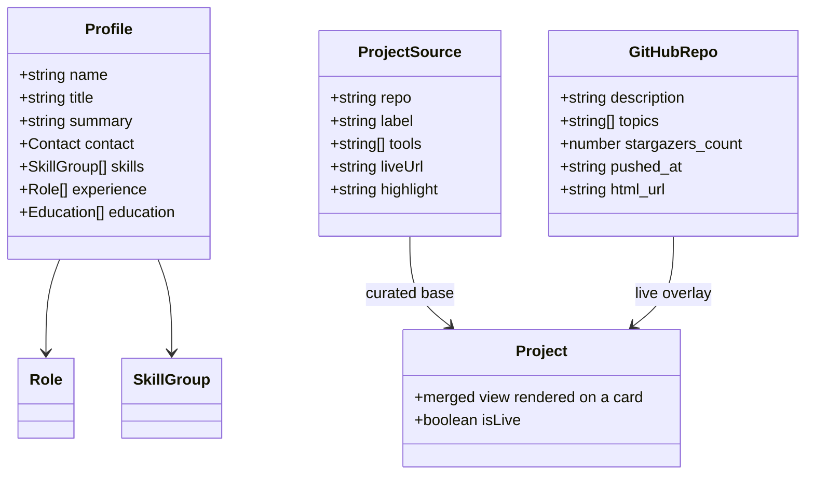

# AIDLC — Phase 1: Inception

*What are we building, and what are the constraints?*

## Problem statement

Elio Cortés is a backend engineer with 15+ years of experience and an active GitHub profile. His CV is a PDF — static, linear, and out of date the moment a repository changes. Recruiters and hiring managers who receive it have no fast way to see **what he has actually built**.

He needs a **personal portfolio site** that presents his career and his pinned GitHub projects together, looks credible on any device, and — critically — **stays current without being rebuilt by hand**. The 2022 Microverse portfolio it supersedes is a static HTML page whose project list has to be hand-edited, which is exactly why it went stale.

## Scope

**In scope (v1):**
- Single-page site with anchored sections: Hero, Projects, Skills, Experience, Education, Contact.
- **Project cards** driven by GitHub's public REST API at runtime — description, tools, stars, last-updated — ordered by the owner's pin order.
- CV-derived content: professional summary, skills by category, experience timeline (condensed to the 4 most recent roles with a reveal for the remaining 6), education and training.
- Responsive layout, 320 px phones through wide desktops.
- Light/dark theme following the OS with a manual override.
- CV PDF download and direct contact links.
- Deployment to GitHub Pages at `https://neckerfree.github.io/portfolio-2026/` via GitHub Actions.

**Non-goals (v1):** a CMS or admin UI, a backend of any kind, a blog, i18n (English only), analytics, a contact form (needs a server or third party — `mailto:` instead), and per-project detail pages. Evolution paths are discussed in [Operation](03-operation.md).

## Personas and user stories

- **Recruiter** (skims for 30 seconds, often on a phone)
  - As a recruiter, I can see **who he is and what he does** above the fold, so I can decide whether to keep reading.
  - As a recruiter, I can **download the CV** and **reach him** in one tap.
- **Hiring manager / tech lead** (evaluates depth)
  - As a tech lead, I can see **real projects with the tools used**, so I can judge relevance to my stack.
  - As a tech lead, I can **click through to the source** on GitHub.
  - As a tech lead, I can scan a **career timeline** without reading a PDF.
- **Elio** (the maintainer — the persona that drives the architecture)
  - As the owner, I can **pin a different repo on GitHub** and have the site reflect it, without touching code.
  - As the owner, I can **add, remove, or reorder** a project by editing **one array in one file**.
  - As the owner, I can **add a project that isn't on GitHub** (client work, private repo) through the same file.

## Acceptance criteria (v1)

| # | Given | When | Then |
|---|-------|------|------|
| AC1 | Any visitor | Lands on the page | Hero shows name, title, summary, and links to GitHub, LinkedIn, email, and the CV PDF |
| AC2 | The pinned-project list | Projects section renders | The 6 pinned repos appear **in pin order**, each with name, description, tool chips, stars and last-updated |
| AC3 | A repo description or topic changed on GitHub | The page is loaded | The card shows the **new** value — no rebuild, no redeploy |
| AC4 | GitHub is unreachable or rate-limits the visitor (HTTP 403) | The page is loaded | Cards still render from the bundled snapshot; a non-alarming notice explains the data may be slightly stale |
| AC5 | A visitor who loaded the site minutes ago | Returns to the page | Cached data is reused — no new API call until the TTL expires |
| AC6 | The owner wants to add/remove/reorder a project | `src/data/projects.ts` is edited | The change takes effect with **no component changes** |
| AC7 | Viewport from 320 px to 1440 px+ | The page is viewed | No horizontal scroll; project grid reflows 1 to 2 to 3 columns; nav collapses on small screens |
| AC8 | 10 roles exist in the CV data | Experience section renders | The 4 most recent show by default; a control reveals the other 6 |
| AC9 | A visitor with a system dark-mode preference | First visit | Dark theme applies; a toggle overrides it and the choice persists across visits |
| AC10 | A keyboard or screen-reader user | Navigates the page | Skip link, visible focus rings, landmark regions, labelled controls, text contrast at least 4.5:1, `prefers-reduced-motion` respected |
| AC11 | A push to `main` | CI/CD runs | Type-check, tests and build pass, and the site deploys to GitHub Pages with assets resolving under the `/portfolio-2026/` sub-path |

## Domain model

The domain is small — two read-only aggregates. There is no persistence layer; `Profile` is authored content, `Project` is the merge of authored content with live GitHub data.

**Merge rule (the heart of the design):** `ProjectSource` is the **authority on identity and order**; GitHub is the **authority on freshness**. A field authored in `ProjectSource` always wins over the API (so a weak or overly long auto-generated description can be overridden); anything not authored falls back to GitHub, then to the bundled snapshot. This is what makes AC3 and AC6 true at the same time.

## Constraints

- **Static hosting only.** GitHub Pages serves files; there is no server, so no secrets can exist in the deployed bundle.
- **Therefore: no GitHub token in the browser.** GitHub's *pinned items* are only exposed through the authenticated GraphQL API, so pin order cannot be read at runtime. It is captured in `projects.ts` instead — pins change rarely; descriptions and stars change often, and those *are* live. This trade-off was chosen deliberately; see ADR-0002.
- **Unauthenticated rate limit: 60 requests/hour per IP.** The design must use **one** request per visitor, cached, with a graceful fallback (AC4, AC5).
- **Sub-path hosting.** The site lives at `/portfolio-2026/`, not at a domain root, so the Vite `base` and all asset URLs must account for it (AC11).
- Node 20+, npm. No backend, no database, no paid services.

## Key decisions (ADRs)

Recorded in [`../adr/`](../adr/):
- **ADR-0001 — Vite + React + TypeScript** as a static SPA; no meta-framework.
- **ADR-0002 — Runtime GitHub REST fetch** over a curated pin list, with a bundled snapshot fallback.
- **ADR-0003 — Hand-authored CSS with design tokens**; no utility or CSS-in-JS framework.
- **ADR-0004 — One page with anchored sections**; no client-side router.
- **ADR-0005 — GitHub Actions to GitHub Pages** deployment.

## Exit criteria

- [x] Problem, scope and non-goals agreed.
- [x] Personas and user stories written, including the maintainer persona.
- [x] Acceptance criteria AC1–AC11 defined and testable.
- [x] Domain model and merge rule specified.
- [x] Constraints — especially the static-hosting/no-token consequence — written down.
- [x] ADRs 0001–0005 recorded.
- [ ] **Signed off by Elio Cortés.**
